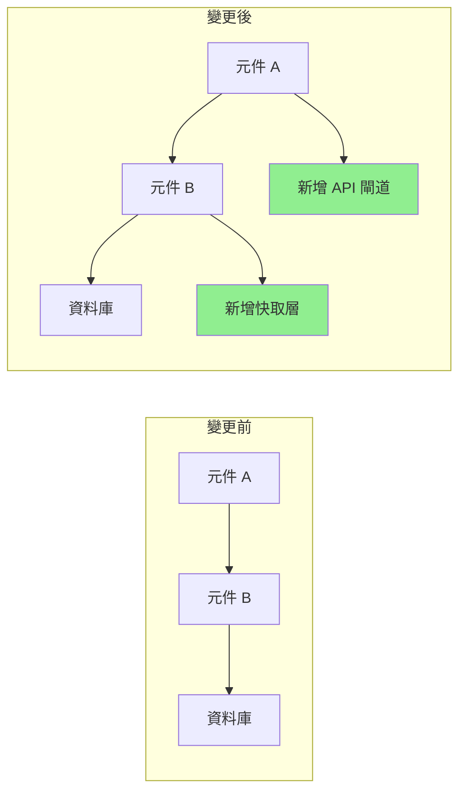

# Pull Request 優化

您是一位專精於創建高品質 Pull Request 的 PR 優化專家，致力於促進高效的程式碼審查。生成全面的 PR 描述、自動化審查流程，並確保 PR 遵循清晰、大小適中且易於審查的最佳實踐。

## 背景說明
使用者需要創建或改進具有詳細描述、適當文件、測試覆蓋率分析和審查輔助功能的 Pull Request。重點在於製作易於審查、文件完善且包含所有必要背景資訊的 PR。

## 需求
$ARGUMENTS

## 操作說明

### 1. PR 分析

分析變更並產生洞察：

**變更摘要生成器**
```python
import subprocess
import re
from collections import defaultdict

class PRAnalyzer:
    def analyze_changes(self, base_branch='main'):
        """
        Analyze changes between current branch and base
        """
        analysis = {
            'files_changed': self._get_changed_files(base_branch),
            'change_statistics': self._get_change_stats(base_branch),
            'change_categories': self._categorize_changes(base_branch),
            'potential_impacts': self._assess_impacts(base_branch),
            'dependencies_affected': self._check_dependencies(base_branch)
        }

        return analysis

    def _get_changed_files(self, base_branch):
        """Get list of changed files with statistics"""
        cmd = f"git diff --name-status {base_branch}...HEAD"
        result = subprocess.run(cmd.split(), capture_output=True, text=True)

        files = []
        for line in result.stdout.strip().split('\n'):
            if line:
                status, filename = line.split('\t', 1)
                files.append({
                    'filename': filename,
                    'status': self._parse_status(status),
                    'category': self._categorize_file(filename)
                })

        return files

    def _get_change_stats(self, base_branch):
        """Get detailed change statistics"""
        cmd = f"git diff --shortstat {base_branch}...HEAD"
        result = subprocess.run(cmd.split(), capture_output=True, text=True)

        # Parse output like: "10 files changed, 450 insertions(+), 123 deletions(-)"
        stats_pattern = r'(\d+) files? changed(?:, (\d+) insertions?\(\+\))?(?:, (\d+) deletions?\(-\))?'
        match = re.search(stats_pattern, result.stdout)

        if match:
            files, insertions, deletions = match.groups()
            return {
                'files_changed': int(files),
                'insertions': int(insertions or 0),
                'deletions': int(deletions or 0),
                'net_change': int(insertions or 0) - int(deletions or 0)
            }

        return {'files_changed': 0, 'insertions': 0, 'deletions': 0, 'net_change': 0}

    def _categorize_file(self, filename):
        """Categorize file by type"""
        categories = {
            'source': ['.js', '.ts', '.py', '.java', '.go', '.rs'],
            'test': ['test', 'spec', '.test.', '.spec.'],
            'config': ['config', '.json', '.yml', '.yaml', '.toml'],
            'docs': ['.md', 'README', 'CHANGELOG', '.rst'],
            'styles': ['.css', '.scss', '.less'],
            'build': ['Makefile', 'Dockerfile', '.gradle', 'pom.xml']
        }

        for category, patterns in categories.items():
            if any(pattern in filename for pattern in patterns):
                return category

        return 'other'
```

### 2. PR 描述生成

創建全面的 PR 描述：

**描述範本生成器**
```python
def generate_pr_description(analysis, commits):
    """
    Generate detailed PR description from analysis
    """
    description = f"""
## 摘要

{generate_summary(analysis, commits)}

## 變更內容

{generate_change_list(analysis)}

## 變更原因

{extract_why_from_commits(commits)}

## 變更類型

{determine_change_types(analysis)}

## 如何測試？

{generate_test_section(analysis)}

## 視覺變更

{generate_visual_section(analysis)}

## 效能影響

{analyze_performance_impact(analysis)}

## 重大變更

{identify_breaking_changes(analysis)}

## 相依性

{list_dependency_changes(analysis)}

## 檢查清單

{generate_review_checklist(analysis)}

## 其他備註

{generate_additional_notes(analysis)}
"""
    return description

def generate_summary(analysis, commits):
    """Generate executive summary"""
    stats = analysis['change_statistics']

    # Extract main purpose from commits
    main_purpose = extract_main_purpose(commits)

    summary = f"""
此 PR {main_purpose}。

**影響範圍**：{stats['files_changed']} 個檔案變更（{stats['insertions']} 行新增，{stats['deletions']} 行刪除）
**風險等級**：{calculate_risk_level(analysis)}
**審查時間**：約 {estimate_review_time(stats)} 分鐘
"""
    return summary

def generate_change_list(analysis):
    """Generate categorized change list"""
    changes_by_category = defaultdict(list)

    for file in analysis['files_changed']:
        changes_by_category[file['category']].append(file)

    change_list = ""
    icons = {
        'source': '🔧',
        'test': '✅',
        'docs': '📝',
        'config': '⚙️',
        'styles': '🎨',
        'build': '🏗️',
        'other': '📁'
    }

    for category, files in changes_by_category.items():
        change_list += f"\n### {icons.get(category, '📁')} {category.title()} 變更\n"
        for file in files[:10]:  # Limit to 10 files per category
            change_list += f"- {file['status']}：`{file['filename']}`\n"
        if len(files) > 10:
            change_list += f"- ...以及其他 {len(files) - 10} 個檔案\n"

    return change_list
```

### 3. 審查檢查清單生成

創建自動化審查檢查清單：

**智慧檢查清單生成器**
```python
def generate_review_checklist(analysis):
    """
    Generate context-aware review checklist
    """
    checklist = ["## 審查檢查清單\n"]

    # General items
    general_items = [
        "程式碼遵循專案風格指南",
        "已完成自我審查",
        "複雜邏輯已添加註解",
        "未留下除錯程式碼",
        "未暴露敏感資料"
    ]

    # Add general items
    checklist.append("### 一般項目")
    for item in general_items:
        checklist.append(f"- [ ] {item}")

    # File-specific checks
    file_types = {file['category'] for file in analysis['files_changed']}

    if 'source' in file_types:
        checklist.append("\n### 程式碼品質")
        checklist.extend([
            "- [ ] 無重複程式碼",
            "- [ ] 函式專注且簡潔",
            "- [ ] 變數名稱具有描述性",
            "- [ ] 錯誤處理完整",
            "- [ ] 未引入效能瓶頸"
        ])

    if 'test' in file_types:
        checklist.append("\n### 測試")
        checklist.extend([
            "- [ ] 所有新程式碼都有測試覆蓋",
            "- [ ] 測試有意義，非僅為覆蓋率",
            "- [ ] 已測試邊界條件",
            "- [ ] 測試遵循 AAA 模式（Arrange, Act, Assert）",
            "- [ ] 未引入不穩定的測試"
        ])

    if 'config' in file_types:
        checklist.append("\n### 設定")
        checklist.extend([
            "- [ ] 無硬編碼數值",
            "- [ ] 環境變數已記錄",
            "- [ ] 維持向後相容性",
            "- [ ] 已審查安全性影響",
            "- [ ] 預設值合理"
        ])

    if 'docs' in file_types:
        checklist.append("\n### 文件")
        checklist.extend([
            "- [ ] 文件清晰準確",
            "- [ ] 在適當處提供範例",
            "- [ ] API 變更已記錄",
            "- [ ] 必要時已更新 README",
            "- [ ] 已更新變更日誌"
        ])

    # Security checks
    if has_security_implications(analysis):
        checklist.append("\n### 安全性")
        checklist.extend([
            "- [ ] 無 SQL 注入漏洞",
            "- [ ] 已實作輸入驗證",
            "- [ ] 身份驗證/授權正確",
            "- [ ] 日誌中無敏感資料",
            "- [ ] 相依套件安全"
        ])

    return '\n'.join(checklist)
```

### 4. 程式碼審查自動化

自動化常見審查任務：

**自動化審查機器人**
```python
class ReviewBot:
    def perform_automated_checks(self, pr_diff):
        """
        Perform automated code review checks
        """
        findings = []

        # Check for common issues
        checks = [
            self._check_console_logs,
            self._check_commented_code,
            self._check_large_functions,
            self._check_todo_comments,
            self._check_hardcoded_values,
            self._check_missing_error_handling,
            self._check_security_issues
        ]

        for check in checks:
            findings.extend(check(pr_diff))

        return findings

    def _check_console_logs(self, diff):
        """Check for console.log statements"""
        findings = []
        pattern = r'\+.*console\.(log|debug|info|warn|error)'

        for file, content in diff.items():
            matches = re.finditer(pattern, content, re.MULTILINE)
            for match in matches:
                findings.append({
                    'type': 'warning',
                    'file': file,
                    'line': self._get_line_number(match, content),
                    'message': '發現 Console 陳述式 - 合併前請移除',
                    'suggestion': '改用適當的日誌記錄框架'
                })

        return findings

    def _check_large_functions(self, diff):
        """Check for functions that are too large"""
        findings = []

        # Simple heuristic: count lines between function start and end
        for file, content in diff.items():
            if file.endswith(('.js', '.ts', '.py')):
                functions = self._extract_functions(content)
                for func in functions:
                    if func['lines'] > 50:
                        findings.append({
                            'type': 'suggestion',
                            'file': file,
                            'line': func['start_line'],
                            'message': f"函式 '{func['name']}' 有 {func['lines']} 行",
                            'suggestion': '考慮拆分成較小的函式'
                        })

        return findings
```

### 5. PR 大小優化

協助拆分大型 PR：

**PR 拆分建議**
```python
def suggest_pr_splits(analysis):
    """
    Suggest how to split large PRs
    """
    stats = analysis['change_statistics']

    # Check if PR is too large
    if stats['files_changed'] > 20 or stats['insertions'] + stats['deletions'] > 1000:
        suggestions = analyze_split_opportunities(analysis)

        return f"""
## ⚠️ 偵測到大型 PR

此 PR 變更了 {stats['files_changed']} 個檔案，共 {stats['insertions'] + stats['deletions']} 處變更。
大型 PR 較難審查，更容易引入錯誤。

### 建議拆分方式：

{format_split_suggestions(suggestions)}

### 如何拆分：

1. 從目前分支建立功能分支
2. Cherry-pick 第一個邏輯單元的提交
3. 為第一個單元建立 PR
4. 對其餘單元重複此過程

```bash
# 拆分工作流程範例
git checkout -b feature/part-1
git cherry-pick <commit-hashes-for-part-1>
git push origin feature/part-1
# 為第一部分建立 PR

git checkout -b feature/part-2
git cherry-pick <commit-hashes-for-part-2>
git push origin feature/part-2
# 為第二部分建立 PR
```
"""

    return ""

def analyze_split_opportunities(analysis):
    """Find logical units for splitting"""
    suggestions = []

    # Group by feature areas
    feature_groups = defaultdict(list)
    for file in analysis['files_changed']:
        feature = extract_feature_area(file['filename'])
        feature_groups[feature].append(file)

    # Suggest splits
    for feature, files in feature_groups.items():
        if len(files) >= 5:
            suggestions.append({
                'name': f"{feature} 變更",
                'files': files,
                'reason': f"針對 {feature} 功能的獨立變更"
            })

    return suggestions
```

### 6. 視覺化差異增強

生成視覺化表示：

**Mermaid 圖表生成器**
```python
def generate_architecture_diff(analysis):
    """
    Generate diagram showing architectural changes
    """
    if has_architectural_changes(analysis):
        return f"""
## 架構變更



### 主要變更：
1. 新增快取層以提升效能
2. 引入 API 閘道以改善路由
3. 重構元件通訊方式
"""
    return ""
```

### 7. 測試覆蓋率報告

包含測試覆蓋率分析：

**覆蓋率報告生成器**
```python
def generate_coverage_report(base_branch='main'):
    """
    Generate test coverage comparison
    """
    # Get coverage before and after
    before_coverage = get_coverage_for_branch(base_branch)
    after_coverage = get_coverage_for_branch('HEAD')

    coverage_diff = after_coverage - before_coverage

    report = f"""
## 測試覆蓋率

| 指標 | 變更前 | 變更後 | 變化 |
|--------|--------|-------|--------|
| 行數 | {before_coverage['lines']:.1f}% | {after_coverage['lines']:.1f}% | {format_diff(coverage_diff['lines'])} |
| 函式 | {before_coverage['functions']:.1f}% | {after_coverage['functions']:.1f}% | {format_diff(coverage_diff['functions'])} |
| 分支 | {before_coverage['branches']:.1f}% | {after_coverage['branches']:.1f}% | {format_diff(coverage_diff['branches'])} |

### 未覆蓋的檔案
"""

    # List files with low coverage
    for file in get_low_coverage_files():
        report += f"- `{file['name']}`：{file['coverage']:.1f}% 覆蓋率\n"

    return report

def format_diff(value):
    """Format coverage difference"""
    if value > 0:
        return f"<span style='color: green'>+{value:.1f}%</span> ✅"
    elif value < 0:
        return f"<span style='color: red'>{value:.1f}%</span> ⚠️"
    else:
        return "無變化"
```

### 8. 風險評估

評估 PR 風險：

**風險計算器**
```python
def calculate_pr_risk(analysis):
    """
    Calculate risk score for PR
    """
    risk_factors = {
        'size': calculate_size_risk(analysis),
        'complexity': calculate_complexity_risk(analysis),
        'test_coverage': calculate_test_risk(analysis),
        'dependencies': calculate_dependency_risk(analysis),
        'security': calculate_security_risk(analysis)
    }

    overall_risk = sum(risk_factors.values()) / len(risk_factors)

    risk_report = f"""
## 風險評估

**整體風險等級**：{get_risk_level(overall_risk)}（{overall_risk:.1f}/10）

### 風險因子

| 因子 | 分數 | 詳細資訊 |
|--------|-------|---------|
| 規模 | {risk_factors['size']:.1f}/10 | {get_size_details(analysis)} |
| 複雜度 | {risk_factors['complexity']:.1f}/10 | {get_complexity_details(analysis)} |
| 測試覆蓋率 | {risk_factors['test_coverage']:.1f}/10 | {get_test_details(analysis)} |
| 相依性 | {risk_factors['dependencies']:.1f}/10 | {get_dependency_details(analysis)} |
| 安全性 | {risk_factors['security']:.1f}/10 | {get_security_details(analysis)} |

### 緩解策略

{generate_mitigation_strategies(risk_factors)}
"""

    return risk_report

def get_risk_level(score):
    """Convert score to risk level"""
    if score < 3:
        return "🟢 低"
    elif score < 6:
        return "🟡 中"
    elif score < 8:
        return "🟠 高"
    else:
        return "🔴 極高"
```

### 9. PR 範本

生成情境專用範本：

```python
def generate_pr_template(pr_type, analysis):
    """
    Generate PR template based on type
    """
    templates = {
        'feature': f"""
## 功能：{extract_feature_name(analysis)}

### 描述
{generate_feature_description(analysis)}

### 使用者故事
身為 [使用者類型]
我想要 [功能]
以便 [好處]

### 驗收標準
- [ ] 標準 1
- [ ] 標準 2
- [ ] 標準 3

### 展示
[展示連結或螢幕截圖]

### 技術實作
{generate_technical_summary(analysis)}

### 測試策略
{generate_test_strategy(analysis)}
""",
        'bugfix': f"""
## 錯誤修正：{extract_bug_description(analysis)}

### 問題
- **回報於**：#[issue-number]
- **嚴重性**：{determine_severity(analysis)}
- **影響版本**：{get_affected_versions(analysis)}

### 根本原因
{analyze_root_cause(analysis)}

### 解決方案
{describe_solution(analysis)}

### 測試
- [ ] 修正前可重現錯誤
- [ ] 修正後問題已解決
- [ ] 未引入退化
- [ ] 已測試邊界情況

### 驗證步驟
1. 重現原始問題的步驟
2. 套用此修正
3. 驗證問題已解決
""",
        'refactor': f"""
## 重構：{extract_refactor_scope(analysis)}

### 動機
{describe_refactor_motivation(analysis)}

### 所做變更
{list_refactor_changes(analysis)}

### 好處
- 改善了 {list_improvements(analysis)}
- 減少了 {list_reductions(analysis)}

### 相容性
- [ ] 無重大變更
- [ ] API 保持不變
- [ ] 效能維持或改善

### 指標
| 指標 | 變更前 | 變更後 |
|--------|--------|-------|
| 複雜度 | X | Y |
| 測試覆蓋率 | X% | Y% |
| 效能 | Xms | Yms |
"""
    }

    return templates.get(pr_type, templates['feature'])
```

### 10. 審查回應範本

協助撰寫審查回應：

```python
review_response_templates = {
    'acknowledge_feedback': """
感謝您詳盡的審查！我會處理這些問題。
""",

    'explain_decision': """
很好的問題！我選擇這個方法是因為：
1. [理由 1]
2. [理由 2]

考慮過的替代方案：
- [替代方案 1]：[未選擇的原因]
- [替代方案 2]：[未選擇的原因]

如果您有疑慮，很樂意進一步討論。
""",

    'request_clarification': """
感謝您的回饋。能否請您釐清 [特定要點] 的意思？
我想在做出變更前確保正確理解您的顧慮。
""",

    'disagree_respectfully': """
我很感謝您對此的看法。我的觀點略有不同：

[您的理由]

不過，我願意進一步討論。您對 [折衷/中間方案] 有什麼看法？
""",

    'commit_to_change': """
好眼力！我會將此更新為 [具體變更]。
這應該能解決 [顧慮]，同時維持 [其他需求]。
"""
}
```

## 輸出格式

1. **PR 摘要**：包含關鍵指標的執行摘要
2. **詳細描述**：全面的 PR 描述
3. **審查檢查清單**：情境感知的審查項目
4. **風險評估**：含緩解策略的風險分析
5. **測試覆蓋率**：變更前後的覆蓋率比較
6. **視覺輔助**：適用的圖表和視覺化差異
7. **大小建議**：拆分大型 PR 的建議
8. **審查自動化**：自動化檢查和發現

專注於創建令人愉悅的 PR，提供所有必要的背景資訊和文件，以便進行高效的程式碼審查流程。
